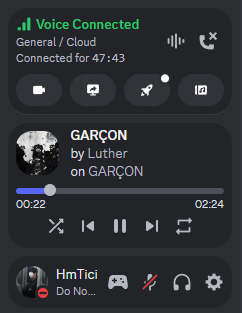
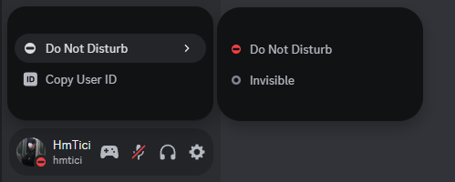

# Rounded (user panel, simplier user pop out, rounded spotify player)

like the title says <br>
I remove the things that I dont use in the user pop out, so it's basically a picker between dnd and invisible status

## Importing

```css
@import url('https://raw.githubusercontent.com/HmTici/discord-css-snippets/main/Rounded%20(user%20panel%2C%20simplier%20user%20pop%20out%2C%20rounded%20spotify%20player)/import.css');
```

### Screenshots





### Contact

My discord <a href="https://discord.com/users/547533758069342249">profile</a>
